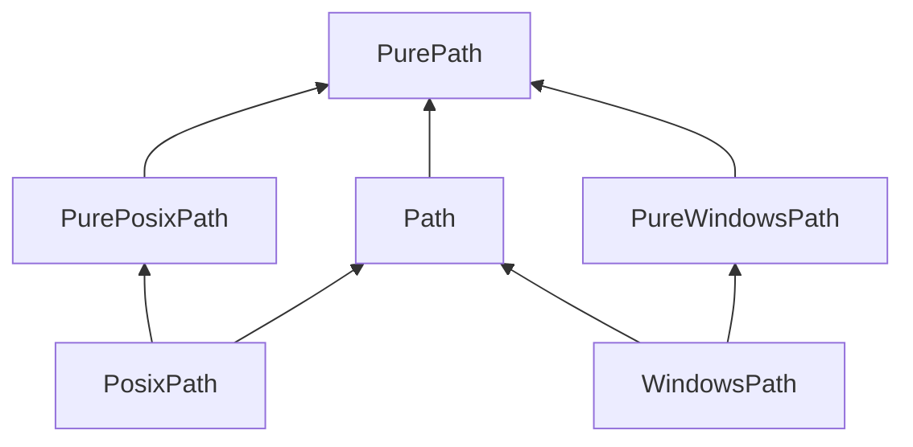

# go-pathlib

A lot of programmers move from Python to Go (myself included). One of Python's best features is the excellent [`pathlib`](https://docs.python.org/3/library/pathlib.html#) module, and personally I've found it difficult to give up. Thus, **`go-pathlib`:** an implementation of `pathlib` for Go, intended to make Pythonistas-turned-Gophers feel a little more at home.

> [!NOTE]
> This package is in extremely early development.
>
> Contributions are welcome!

## Similarities to `pathlib`

Like Python's `pathlib`, `go-pathlib` contains two primary types: `Path` and `PurePath`.

`PurePath` is the base type upon which all else rests. `PurePath` instances provide purely computational operations _without I/O_.

`Path` types, also known as "concrete paths," contain embedded `PurePath` structs and provide I/O operations.

Additionally, both `PurePath` and `Path` contain OS-specific implementations: `PurePosixPath`, `PureWindowsPath`, `PosixPath`, and `WindowsPath`.

Just like Python's `pathlib`, their relationships can be diagrammed as follows:

## Deviations from `pathlib`

In contrast to `chigopher`'s Go package [`pathlib`](https://pkg.go.dev/github.com/chigopher/pathlib), which states "it takes many cues from Python's `pathlib`, although it does not strictly adhere to its design philosophy," `go-pathlib` _does_ -- an effort has been made to keep `go-pathlib` as similar to `pathlib` as possible, even when that results in some minor code smells such as embedded structs.

However, some deviations from `pathlib` proved to be inevitable:

- Obviously, capitalizations must change due to Go's export system.
- As `Path` and `PurePath` are interfaces, properties in `pathlib` are now methods in `go-pathlib`, e.g. `Path.name` becomes `Path.Name()`.
- Because Go does not support generic type parameters for methods, the following methods have been split into two:
  - `Path.rename()` -> `Path.RenameToPath(target Path)` and `Path.RenameToString(target String)`
  - `Path.replace()` -> `Path.ReplaceWithPath(target Path)` and `Path.ReplaceWithString(target string)`
  - `Path.hardlink_to()` -> `Path.HardlinkToPath(target Path)` `Path.HardlinkToString(target string)`

Additionally, some quality-of-life improvements not present in `pathlib` have been added:

- `Path.AsString()`
- `path.NewFromPurePath()`

## Parity with `pathlib`

| `pathlib` function                                                                              | `go-pathlib` function                                                                        |  status  | test coverage |
| :---------------------------------------------------------------------------------------------- | :------------------------------------------------------------------------------------------- | :------: | :-----------: |
| [`Path.absolute()`](https://docs.python.org/3/library/pathlib.html#pathlib.Path.absolute)       | [`Path.Absolute()`](https://github.com/rewgs/go-pathlib/blob/main/path/base.go#L31)          |   todo   |     todo      |
| [`Path.chmod()`](https://docs.python.org/3/library/pathlib.html#pathlib.Path.chmod)             | [`Path.Chmod()`](https://github.com/rewgs/go-pathlib/blob/main/path/base.go#L46)             |   todo   |     todo      |
| [`Path.cwd()`](https://docs.python.org/3/library/pathlib.html#pathlib.Path.cwd)                 | [`path.Cwd()`](https://github.com/rewgs/go-pathlib/blob/main/path/funcs.go#L22)              | finished |     todo      |
| [`Path.exists()`](https://docs.python.org/3/library/pathlib.html#pathlib.Path.exists)           | [`Path.Exists()`](https://github.com/rewgs/go-pathlib/blob/main/path/base.go#L55)            | finished |  in progress  |
| [`Path.expanduser()`](https://docs.python.org/3/library/pathlib.html#pathlib.Path.expanduser)   | [`Path.ExpandUser()`](https://github.com/rewgs/go-pathlib/blob/main/path/base.go#L73)        |   todo   |     todo      |
| [`Path.hardlink_to()`](https://docs.python.org/3/library/pathlib.html#pathlib.Path.hardlink_to) | [`Path.HardlinkToPath()`](https://github.com/rewgs/go-pathlib/blob/main/path/base.go#L106)   |   todo   |     todo      |
|                                                                                                 | [`Path.HardlinkToString()`](https://github.com/rewgs/go-pathlib/blob/main/path/base.go#L113) |   todo   |     todo      |
| [`Path.is_dir()`](https://docs.python.org/3/library/pathlib.html#pathlib.Path.is_dir)           | [`Path.IsDir()`](https://github.com/rewgs/go-pathlib/blob/main/path/base.go#L142)            |   todo   |               |
| [`Path.is_file()`](https://docs.python.org/3/library/pathlib.html#pathlib.Path.is_file)         | [`Path.IsFile()`](https://github.com/rewgs/go-pathlib/blob/main/path/base.go#L161)           |   todo   |               |
| [`Path.is_junction()`](https://docs.python.org/3/library/pathlib.html#pathlib.Path.is_junction) | `Path.IsJunction()`                                                                          |   todo   |               |
| [`Path.is_mount()`](https://docs.python.org/3/library/pathlib.html#pathlib.Path.is_mount)       | `Path.IsMount()`                                                                             |   todo   |               |
| [`Path.is_symlink()`](https://docs.python.org/3/library/pathlib.html#pathlib.Path.is_symlink)   | `Path.IsSymlink()`                                                                           |   todo   |               |
| [`Path.iterdir()`](https://docs.python.org/3/library/pathlib.html#pathlib.Path.iterdir)         | `Path.Iterdir()`                                                                             |   todo   |               |
| [`Path.lchmod()`](https://docs.python.org/3/library/pathlib.html#pathlib.Path.lchmod)           | `Path.Lchmod()`                                                                              |   todo   |               |
| [`Path.lstat()`](https://docs.python.org/3/library/pathlib.html#pathlib.Path.lstat)             | `Path.Lstat()`                                                                               |   todo   |               |
| [`Path.mkdir()`](https://docs.python.org/3/library/pathlib.html#pathlib.Path.mkdir)             | `Path.Mkdir()`                                                                               |   todo   |               |
| [`Path.resolve()`](https://docs.python.org/3/library/pathlib.html#pathlib.Path.resolve)         | `Path.Resolve()`                                                                             |   todo   |               |
| [`Path.readlink()`](https://docs.python.org/3/library/pathlib.html#pathlib.Path.readlink)       | `Path.Readlink()`                                                                            |   todo   |               |
| [`Path.rename()`](https://docs.python.org/3/library/pathlib.html#pathlib.Path.rename)           | `Path.Rename()`                                                                              |   todo   |               |
| [`Path.replace()`](https://docs.python.org/3/library/pathlib.html#pathlib.Path.replace)         | `Path.Replace()`                                                                             |   todo   |               |
| [`Path.samefile()`](https://docs.python.org/3/library/pathlib.html#pathlib.Path.samefile)       | `Path.Samefile()`                                                                            |   todo   |               |
| [`Path.stat()`](https://docs.python.org/3/library/pathlib.html#pathlib.Path.samefile)           | `Path.Stat()`                                                                                |   todo   |               |
| [`Path.symlink_to()`](https://docs.python.org/3/library/pathlib.html#pathlib.Path.symlink_to)   | `Path.SymlinkTo()`                                                                           |   todo   |               |
| [`Path.unlink()`](https://docs.python.org/3/library/pathlib.html#pathlib.Path.unlink)           | `Path.Unlink()`                                                                              |   todo   |               |
| [`Path.rmdir()`](https://docs.python.org/3/library/pathlib.html#pathlib.Path.rmdir)             | `Path.Rmdir()`                                                                               |   todo   |               |
| [`Path.walk()`](https://docs.python.org/3/library/pathlib.html#pathlib.Path.walk)               | `Path.Walk()`                                                                                |   todo   |               |
| [`Path.home()`](https://docs.python.org/3/library/pathlib.html#pathlib.Path.home)               | [`path.Home()`](https://github.com/rewgs/go-pathlib/blob/main/path/funcs.go#L11)             | finished |     todo      |
