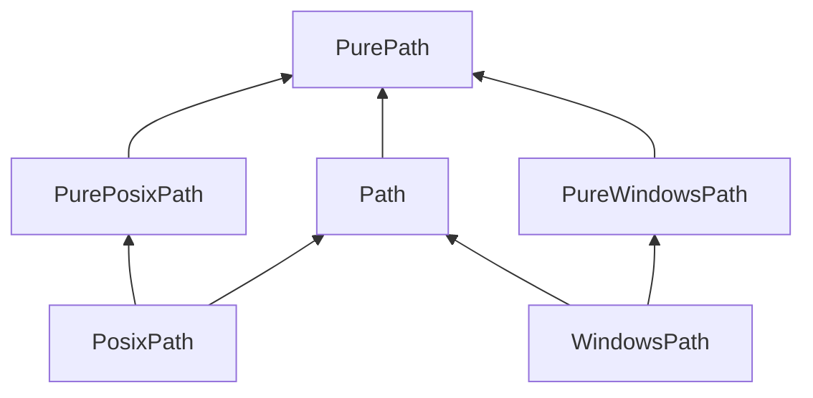

# go-pathlib

Lots of programmers move from Python to Go (myself included). One of Python's best features is the excellent [`pathlib`](https://docs.python.org/3/library/pathlib.html#) module, and personally I've found it difficult to give up. Thus, `go-pathlib`: an implementation of `pathlib` for Go, intended to make Pythonistas-turned-Gophers feel a little more at home.

This package is in extremely early development. Contributions are welcome!

## Similarities to `pathlib`

Like Python's `pathlib`, `go-pathlib` contains two base types: `Path` and `PurePath`.

`PurePath` is the base type upon which all else rests. `PurePath` instances provide purely computational operations _without I/O_.

`Path` types, also known as "concrete paths," contain embedded `PurePath` structs and provide I/O operations.

Additionally, both `PurePath` and `Path` contain OS-specific implementations: `PurePosixPath`, `PureWindowsPath`, `PosixPath`, and `WindowsPath`. Their relationships can be diagrammed as follows:

## Deviations from `pathlib`

In contrast to `chigopher`'s Go package [`pathlib`](https://pkg.go.dev/github.com/chigopher/pathlib), which states "it takes many cues from Python's `pathlib`, although it does not strictly adhere to its design philosophy," `go-pathlib` _does_ -- an effort has been made to keep `go-pathlib` as similar to `pathlib` as possible, even when that results in some minor code smells such as embedded structs.

However, some changes are inevitable; namely:

- Obviously, capitalizations must change due to Go's export system.
- As `Path` and `PurePath` are interfaces, properties in `pathlib` are now methods in `go-pathlib`, e.g. `Path.name` becomes `Path.Name()`.
- Because Go does not support generic type parameters for methods, `Path.rename()` has been split into two methods: `Path.RenameToPath(target Path)` and `Path.RenameToString(target String)`
- `Path.replace()` has been split into `Path.ReplaceWithPath(target Path)` and `Path.ReplaceWithString(target string)` for the same reason.

Additionally, some quality-of-life improvements have been added, such as `Path.AsString()` and `path.NewFromPurePath()`.

<!-- NOTE: This is extremely out of date. Commenting out until I have the chance to take a look at the state of the progress. -->
<!-- ## Parity with `pathlib` -->
<!-- | `pathlib` function                                                                    | `go-pathlib` function | status      | -->
<!-- | :------------------------------------------------------------------------------------ | :-------------------- | :---------- | -->
<!-- | `Path.absolute()`                                                                     | `Absolute()`          | todo        | -->
<!-- | `Path.chmod()`                                                                        | `Chmod()`             | todo        | -->
<!-- | `Path.cwd()`                                                                          | `path.Cwd()`               | todo        | -->
<!-- | [`Path.exists()`](https://docs.python.org/3/library/pathlib.html#pathlib.Path.exists) | `Exists()`            | in progress | -->
<!-- | `Path.expanduser()`                                                                   | `ExpandUser()`        | todo        | -->
<!-- | `Path.hardlink_to()`                                                                  | `HardlinkTo()`        | todo        | -->
<!-- | `Path.is_dir()`                                                                       | `IsDir()`             | todo        | -->
<!-- | `Path.is_file()`                                                                      | `IsFile()`            | todo        | -->
<!-- | `Path.is_junction()`                                                                  | `IsJunction()`        | todo        | -->
<!-- | `Path.is_mount()`                                                                     | `IsMount()`           | todo        | -->
<!-- | `Path.is_symlink()`                                                                   | `IsSymlink()`         | todo        | -->
<!-- | `Path.iterdir()`                                                                      | `Iterdir()`           | todo        | -->
<!-- | `Path.lchmod()`                                                                       | `Lchmod()`            | todo        | -->
<!-- | `Path.lstat()`                                                                        | `Lstat()`             | todo        | -->
<!-- | `Path.mkdir()`                                                                        | `Mkdir()`             | todo        | -->
<!-- | `Path.resolve()`                                                                      | `Resolve()`           | todo        | -->
<!-- | `Path.readlink()`                                                                     | `Readlink()`          | todo        | -->
<!-- | `Path.rename()`                                                                       | `Rename()`            | todo        | -->
<!-- | `Path.replace()`                                                                      | `Replace()`           | todo        | -->
<!-- | `Path.samefile()`                                                                     | `Samefile()`          | todo        | -->
<!-- | `Path.stat()`                                                                         | `Stat()`              | todo        | -->
<!-- | `Path.symlink_to()`                                                                   | `SymlinkTo()`         | todo        | -->
<!-- | `Path.unlink()`                                                                       | `Unlink()`            | todo        | -->
<!-- | `Path.rmdir()`                                                                        | `Rmdir()`             | todo        | -->
<!-- | `Path.walk()`                                                                         | `Walk()`              | todo        | -->
